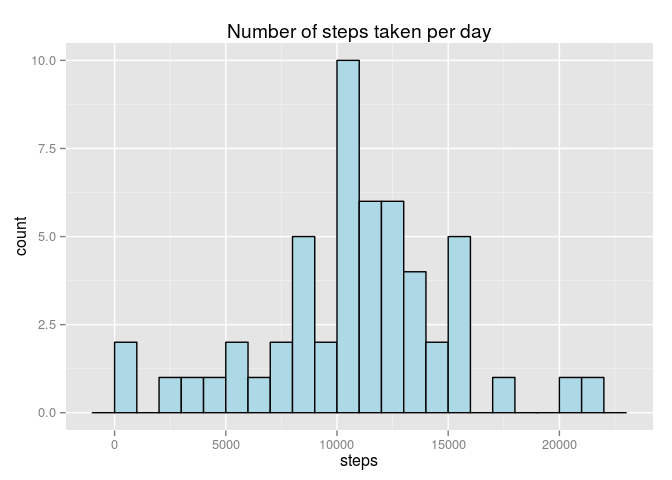
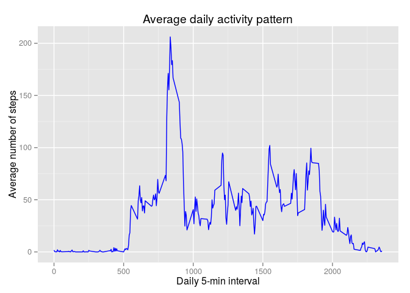
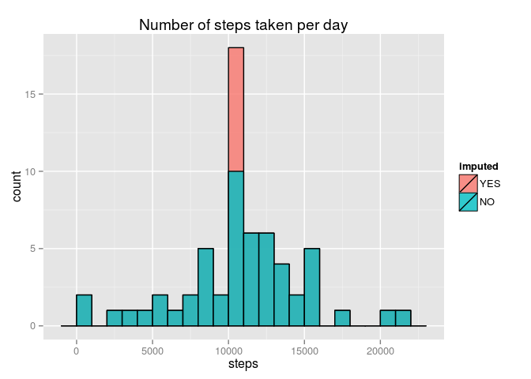
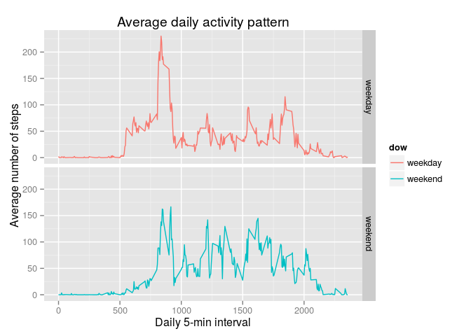

# Reproducible Research: Peer Assessment 1
Alexandre Ph. Clement  
13/01/2015  


## Introduction

It is now possible to collect a large amount of data about personal movement using activity monitoring devices such as a Fitbit, Nike Fuelband, or Jawbone Up. These type of devices are part of the “quantified self” movement – a group of enthusiasts who take measurements about themselves regularly to improve their health, to find patterns in their behavior, or because they are tech geeks. But these data remain under-utilized both because the raw data are hard to obtain and there is a lack of statistical methods and software for processing and interpreting the data.

This assignment makes use of data from a personal activity monitoring device. This device collects data at 5 minute intervals through out the day. The data consists of two months of data from an anonymous individual collected during the months of October and November, 2012 and include the number of steps taken in 5 minute intervals each day.

## Getting the data

The dataset is downloaded from the internet and unzip. The result is a csv file.


```r
  download.file(url = "https://d396qusza40orc.cloudfront.net/repdata%2Fdata%2Factivity.zip", 
                destfile = "activity.zip", method = "curl")

  unzip('activity.zip')  
```

## Loading and preprocessing the data
The csv file is loaded into the memory. The dates are parsed with the default format.


```r
  raw_activity <- read.csv('activity.csv', stringsAsFactors = F) 
  # parse dates
  raw_activity$date <- as.Date(raw_activity$date)
  # remove incomplete cases (rows with at least 1 NA value)
  activity <- na.omit(raw_activity)
  head(activity)
```

```
##     steps       date interval
## 289     0 2012-10-02        0
## 290     0 2012-10-02        5
## 291     0 2012-10-02       10
## 292     0 2012-10-02       15
## 293     0 2012-10-02       20
## 294     0 2012-10-02       25
```

## What is mean total number of steps taken per day?

### Histogram


```r
library(dplyr)
library(ggplot2)

# set defaut histogram binwidth
binwidth <- 1000

results <- activity %>%
  group_by(date) %>%
  summarise(steps = sum(steps))

g <- ggplot(results, aes(x = steps))
g <- g + geom_histogram(fill = 'lightblue', col = 'black', binwidth = binwidth)
g <- g + labs(title = "Number of steps taken per day")
g
```

 

### Mean


```r
mean(results$steps)
```

```
## [1] 10766
```

### Median


```r
median(results$steps)
```

```
## [1] 10765
```

## What is the average daily activity pattern?

### Plot


```r
avgByInterval <- activity %>%
  group_by(interval) %>%
  summarise(avg = mean(steps))

g <- ggplot(avgByInterval, aes(x = interval, y = avg))
g <- g + geom_line(color = 'blue')
g <- g + labs(x = "Daily 5-min interval", y = "Average number of steps", title = "Average daily activity pattern")
g
```

 

### 5-minute interval containing the maximum number of steps


```r
orderByAvg <- avgByInterval %>% arrange(desc(avg))
orderByAvg[1, ]$interval
```

```
## [1] 835
```

## Imputing missing values

### Total number of missing values in the dataset 


```r
sum(!complete.cases(raw_activity)) 
```

```
## [1] 2304
```

### Computing 5-minute interval mean values

Now we will devise a strategy for filling in all of the missing values in the dataset.
We can not use day mean value for imputing because values are missing for the whole day in each case.
We will use the mean for the corresponding 5-minute interval instead.


```r
# recompute 5-minute interval average value
means <- raw_activity %>%
  group_by(interval) %>%
  summarise(avg = mean(steps, na.rm = T))
means
```

```
## Source: local data frame [288 x 2]
## 
##    interval     avg
## 1         0 1.71698
## 2         5 0.33962
## 3        10 0.13208
## 4        15 0.15094
## 5        20 0.07547
## 6        25 2.09434
## 7        30 0.52830
## 8        35 0.86792
## 9        40 0.00000
## 10       45 1.47170
## ..      ...     ...
```

### Filling in the missing data

Create a new dataset that is equal to the original dataset but with the missing data filled in.


```r
# replace NA with the mean of the corresponding 5-min interval
new_activity <- raw_activity %>% 
  mutate(steps = ifelse(is.na(steps), means[means$interval %in% interval, ]$avg, steps))
```

### Histogram of the new dataset


```r
new_results <- new_activity %>%
  group_by(date) %>%
  summarise(steps = sum(steps))

results$imputed <- 'NO'
new_results$imputed <- 'YES'
merged_results <- rbind(new_results, results)
merged_results$imputed <- ordered(merged_results$imputed, levels = c('YES', 'NO'))

g <- ggplot(merged_results, aes(x = steps, fill = imputed))
g <- g + geom_histogram(binwidth = binwidth, col = 'black', alpha = .8, position = "identity")
g <- g + labs(title = "Number of steps taken per day")
g
```

 

### Mean


```r
mean(new_results$steps)
```

```
## [1] 10766
```

### Median


```r
median(new_results$steps)
```

```
## [1] 10766
```

### Impact of imputing missing data 

Do these values differ from the estimates from the first part of the assignment? What is the impact of imputing missing data on the estimates of the total daily number of steps?

The mean and median are almost the same than those of the first part of the assignment. 
The impact of imputing missing data on the estimates of the total daily number of steps is to raise the number of mean values.

## Are there differences in activity patterns between weekdays and weekends?

### dow factor

Let's create a new variable dow indicating wether a given date is a weekday or weekend day.


```r
library(lubridate)
new_activity$dow <- as.factor(ifelse(wday(new_activity$date) %in% c(1, 7), "weekend", "weekday")) 
```

### Plot

```r
avgByInterval <- new_activity %>%
  group_by(interval, dow) %>%
  summarise(avg = mean(steps))

g <- ggplot(avgByInterval, aes(x = interval, y = avg, color = dow))
g <- g + geom_line() + facet_grid(dow ~ .)
g <- g + labs(x = "Daily 5-min interval", y = "Average number of steps", title = "Average daily activity pattern")
g
```

 

